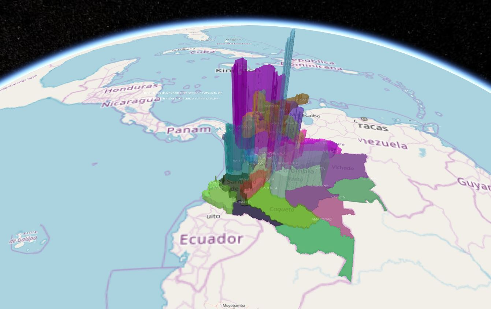
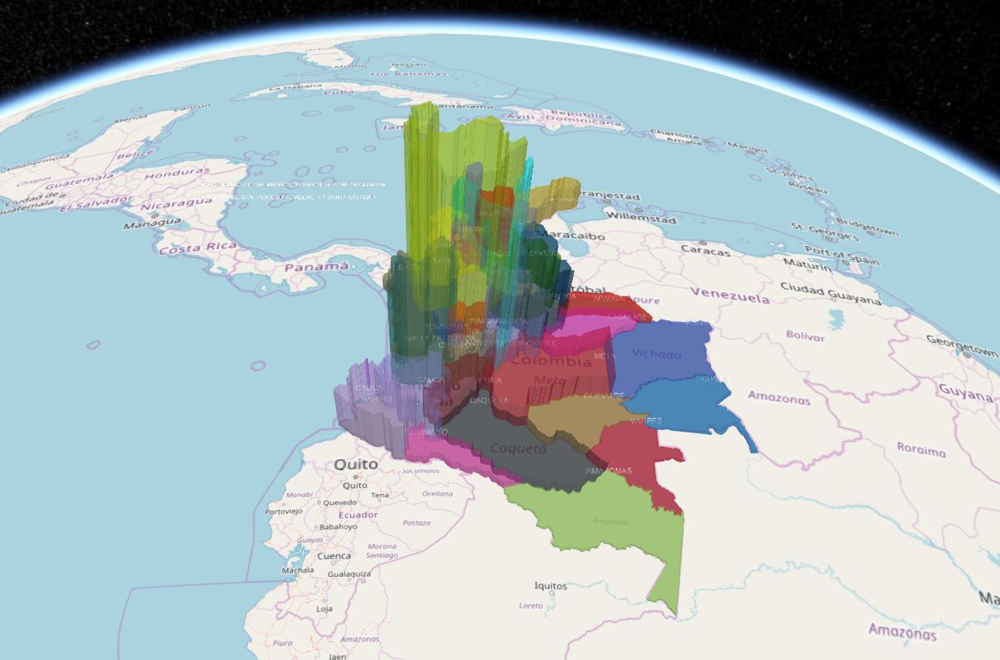

<p align="center">

</p>

[](https://travis-ci.org/AnalyticalGraphicsInc/cesium)&nbsp;
[](http://cesiumjs.org/tutorials.html)

Cesium is a JavaScript library for creating 3D globes and 2D maps in a web browser without a plugin. It uses WebGL for hardware-accelerated graphics, and is cross-platform, cross-browser, and tuned for dynamic-data visualization.

http://cesiumjs.org/

### Get Started ###

Visit the [Downloads page](http://cesiumjs.org/downloads.html) or use the npm module:
```
npm install cesium
```

### License ###

[Apache 2.0](http://www.apache.org/licenses/LICENSE-2.0.html).  Cesium is free for both commercial and non-commercial use.

We appreciate attribution by including the Cesium logo and link in your app.


To see the apps copy the folders and files into the Apps forlder, the Data folder in the general projec tand with these routesyou can visualize the result

> http://localhost:8080/Apps/geojson/

> http://localhost:8080/Cesium/Apps/Colombia/poblacion.html

> http://localhost:8080/Cesium/Apps/Colombia/pib.html

<p align="center">
  
  
  
</p>